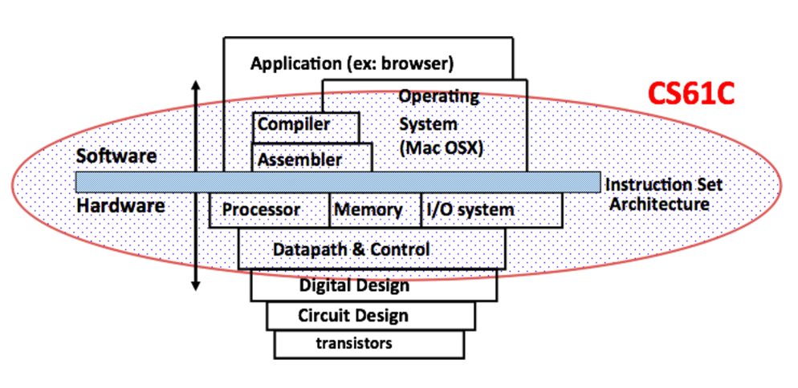

# Lecture01-Number Representation

## 1. Course Overview

1. How do computer processors and memories work, and how do they affect software design and performance?
2. Introduction to “computer systems” areas: architecture, compilers, security, embedded, operating systems, large-scale computing

### Six Great Idea

* Abstraction
* Technology Trends
* Principle of Locality/Memory Hierarchy
* Parallelism
* Performance Measurement & Improvement
* Dependability via Redundancy

## 2. Number Representation 

***Bits Can Represent ANYTHING***

***n digits (base B) --->  <= B^n things***

* Each of the n digits is one of B possible symbols
* Have more things? Add more digits! 

### 2.1 Number Bases(Or Radix)

* Decimal (base 10)
  * Symbols: 0, 1, 2, 3, 4, 5, 6, 7, 8, 9
  * Notation: 9472ten = 9472
* Binary (base 2)
  * Symbols: 0, 1
  * Notation: 101011two = 0b101011
* Hexadecimal (base 16)
  * Symbols: 0, 1, 2, 3, 4, 5, 6, 7, 8, 9, A, B, C, D, E, F
  * Notation: 2A5Dhex = 0x2A5D

### 2.2 Signed Representations

* **Sign and Magnitude**: “first” bit gives sign, rest treated as unsigned (magnitude)

* **Biased Notation**: Like unsigned, but “shifted” so zero is (roughly) in the middle ***(value = “unsigned value” - bias)***

* **One’s Complement**: New negation procedure – complement the bits

* **Two’s Complement**: Like One’s Complement, but “shift” negative #s by 1

  * Expect the normal way, we can find that: 

    `0b10101101` = $-1\times 2^7+(\text{0b00101101})_{\text{bin}}$ = $-128+45$ = $-83$ = $-[(\text{0b01010010})_{\text{bin}}+1]$ = $-(\text{0b01010011})_{\text{bin}}$ = $-83$

  * A neat trick for flipping the sign of a two’s complement number: flip all the bits and add 1

  * Addition is exactly the same as with an unsigned number

  * Only one 0, and it’s located at 0b0 

### 2.3 Overflow

Overflow is when the result of an arithmetic operation can’t be represented by the (FINITE) hardware bits:

*  **"+"** + **"+"** or **"-"** + **"-"** may happen OVERFLOW

*  **"+"** + **"-"** or **"-"** + **"+"** can never be happen OVERFLOW

**<u>*Overflow occurs if and only if two numbers with the same sign are added and the result has the opposite sign*</u>** 

### 2.4 Sign Extension

Want to represent the same number using more bits than before

#### Methods:

* Sign and magnitude: add 0’s after the sign bit
* One’s/Two’s complement: copy MSB

#### Example:

* Sign and magnitude: 0b 11 = 0b 1001
* One’s/Two’s complement: 0b 11 = 0b 1111

## 3. Complement by myself

[two's complement, why the name "two"](https://stackoverflow.com/questions/2604296/twos-complement-why-the-name-two)

