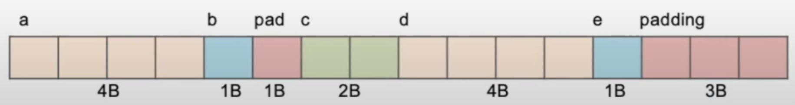
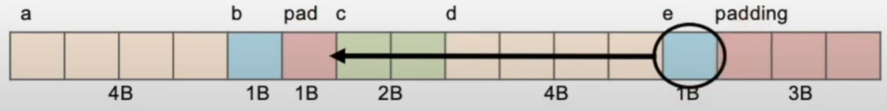

# Lecture03 C Arrays and Strings

## 1 Operator

* `sizeof()` is a operator, return size **in bytes**
  * when acts a `structs`, it returns size of one instance of struct **(sum of sizes of all struct variables + padding)**
* Prefix ( `++p` ) takes effect immediately
*  Postfix/Suffix ( `p++` ) takes effect last

## 2. More Pointers

* Modern machines are **byte-addressable**
* a C pointer is just abstracted memory address
* Type declaration tells complier how may bytes to fetch on each access through pointer
  * E.g., 32-bit integer stored 4 consecutive 8-bit bytes
* <u>But we want **word alignment !!!!!!!**</u>
  * Some processors will not allow you to address 32b values **without being on 4 byte boundaries**
  * Others will just **be very slow** if you try to access “unaligned” memory.

## 3. Sturct Alignment

### 3.1 For example:

```c
struct hello{
    int a;
    chat b;
    short c;
    char* d;
    char e;
};
```

**!`sizeof(struct hello) = 16`:**


* <u>***QUESTION!?*** why there is padding between `b` and `c`, to alignment, I think it should be `4 bytes` for a small element</u>
* <u>***QUESTION!?*** why there is padding between `b` and `c`, to alignment, I think it should be `4 bytes` for a small element</u>
* <u>***QUESTION!?*** why there is padding between `b` and `c`, to alignment, I think it should be `4 bytes` for a small element</u>

### 3.2 How to save space?

* **put `e` before the "`short c`"**

```c
struct hello{
    int a;
    chat b;
    char e;
    short c;
    char* d;
};
```

**!`sizeof(struct hello) = 12`:**



