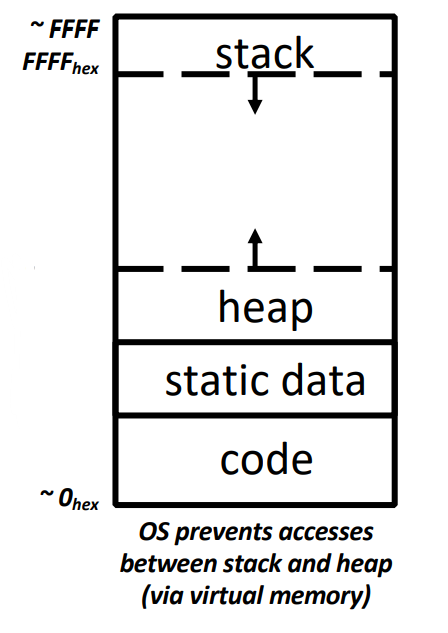
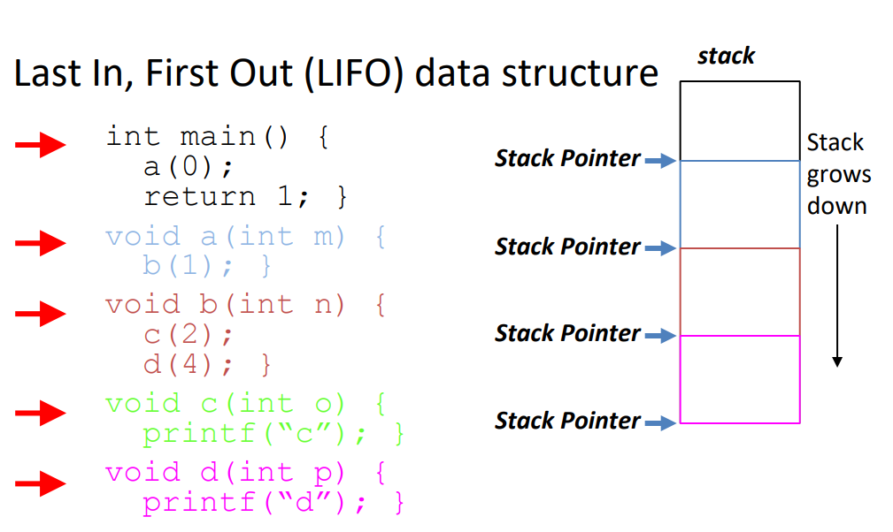
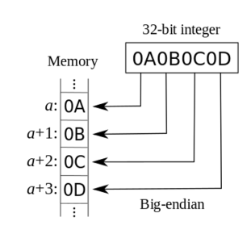
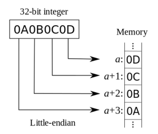

# Lecture04 C Memory

## 1. Memory Layout

### 1.1 Layout



### 1.2 Stack



* Each **<u>stack frame</u>** is a contiguous block of memory holding **the local variables** of a **single** procedure(Function)

* A stack frame includes
  * Location of caller function
  * Function arguments
  * Space for local variables

* **Stack pointer (SP)** tells where lowest (current) stack frame is

* When procedure ends, stack pointer is moved back **<u>(but data remains (*garbage!*))</u>**; frees memory for future stack frames; [For example]

  ```C
  int *getPtr() {
  	int y;
  	y = 3;
  	return &y;
  };
  int main () {
  	int *stackAddr,content;
  	stackAddr = getPtr();
  	content = *stackAddr;  /* assign the value to content, it has not been overwritten yet */
  	printf("%d", content); /* 3 */
  	content = *stackAddr;  /* Because of the printf in row#10, t has been overwritten */
  	printf("%d", content); /* ? */
  };
  ```


### 1.3 Static Data

* **Size does not change, but sometimes data can**
* Place for variables that persist
  * String literal example: `char * str = “hi”`;
  * Do not be mistaken with: `char str[] = “hi”`  ***(This will put str on the stack!)***

### 1.4 Heap

* Need as much space as possible without interfering with Stack: **Start at opposite end and grow towards Stack (look at pic-1 below)**
* 3 functions for requesting memory: 
  * `malloc()`
    * Returns a pointer to the beginning of the allocated block; **NULL indicates failed request (check for this!)**
    * `int *p = (int *) malloc(n*sizeof(int));`
  * `calloc()`
    * Returns a pointer to the beginning of the allocated block; **NULL indicates failed request (check for this!)**
    * `int *p = (int *) calloc (5, sizeof (int));`
  * `realloc()`
    * `Realloc `can move or keep the address the  same, so **DO NOT rely on old ptr values**
    * Returns a pointer with now size space (or NULL) and copies any contents from ptr
* `free()`
  * `p` must be the address originally returned by `m/c/realloc()`, otherwise throws system exception
  * Make sure you don’t lose the ori**ginal address**: eg: `p++` is a ***BAD IDEA***; use a separate pointer
  * **<u>*Rule of Thumb: More mallocs than frees probably indicates a memory leak*</u>**

### 1.5 Code 

* Copy of your code goes here
  * C code**<u>*(??)*</u>** becomes data too!
* Does (should) not change
  * Typically read only

## 2. Endianness

### 2.1 Big Endian

**Descending** numerical significance with **ascending** memory addresses: 

### 2.2 Little Endian

**Ascending** numerical significance with **ascending** memory addresses: 



## 3.  Memory Errors

* **Segmentation Fault**
  * “An error in which a running Unix program **<u>attempts to access memory not allocated to it</u>** and terminates with a segmentation violation error and usually a core dump.”
  * 也称访问权限冲突（access violation），是一种程序错误。它会出现在当程序企图访问CPU无法[寻址](https://zh.wikipedia.org/wiki/%E5%AE%9A%E5%9D%80)的[存储器区段](https://zh.wikipedia.org/wiki/%E8%A8%98%E6%86%B6%E9%AB%94%E5%8D%80%E6%AE%B5)时。当错误发生时，硬件会通知操作系统产生了存储器访问权限冲突的状况。[操作系统](https://zh.wikipedia.org/wiki/%E4%BD%9C%E6%A5%AD%E7%B3%BB%E7%B5%B1)通常会产生[核心转储](https://zh.wikipedia.org/wiki/%E6%A0%B8%E5%BF%83%E8%BD%AC%E5%82%A8)（core dump）以方便程序员进行调试。通常该错误是由于调用一个地址，而该地址为空（NULL）所造成的，例如[链表](https://zh.wikipedia.org/wiki/%E9%8F%88%E8%A1%A8)中调用一个未分配地址的空链表单元的元素。[数组访问越界](https://zh.wikipedia.org/w/index.php?title=%E6%95%B0%E7%BB%84%E8%AE%BF%E9%97%AE%E8%B6%8A%E7%95%8C&action=edit&redlink=1)也可能产生这个错误
* **Bus Error**
  * “A fatal failure in the execution of a machine language instruction resulting from the processor detecting an anomalous condition on its bus. Such conditions include **<u>invalid address alignment (accessing a multi- byte number at an odd address)</u>**, accessing a physical address that does not correspond to any device, or some other device-specific hardware error.”

  * 总线错误（bus error），几乎都是**有内存未对齐读引起**的。内存对齐，就是内存变量的地址只能是其大小的整数倍，这样存储的目的就是为了方便并快速存取内存。一般情况下，编译器都会做好内存对齐工作，为什么又会引发段故障呢？很多情况就是由指针和强制类型转换引起的，如：

    ```C
    union{
        char a[10];
        int i;
    }u;

    int *p = (int *)&(u.a[1]);
    *p = 17;
    ```

  * 当然，还有一些其它原因会引起“总线错误”，如奇偶校验码错误，所引用的内存块不存在。但是现在，内存都有硬件电路检测和修正，一般不会再传到软件层了；除了驱动程序，一般也不会引用不存在的内存块。

## 4. Complement by myself

* why a byte has 8 bits?
* 8 bytes and 8 bits?
* Code space store c text code or machine code or etc. ?

