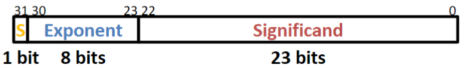

# Lecture05 Floating Point

* How to represent a **Real Number** (such as $\pi$ , $e$ , etc.) ?
* How to represent a very **large/small** number?
* How to represent **infinite** or **Not a Number** (`NaN`) ?

## 1. Scientific Notation (Binary)
For example, in the below case, `0b1.001101` is **significand**, and `.` is binary point, `2` in $\times 2^{101}$ is **radix (base)**, and `0b101` in $\times 2^{101}$ is exponent
$$
1.001101\times 2^{101}
$$
Computer arithmetic that supports this called 
floating point due to **the “floating” of the 
binary point**

## 2. Floating Point Encoding
### 2.1 Single Precision
* Use normalized, Base 2 **scientific notation**:
    $$
    \pm 1.xxx\cdots x_{\text{(bin)}} \times 2^{yyy\cdots y_{\text{(bin)}}}
    $$
* **🏆** Split a **32-bit** word into **3** fields
    

#### 1) `S` field

* **`S` field has 1 bit**
* It represents Sign, which $0$ is positive, $1$ is negative

#### 2) `Exponent` field

* **`Exponent` field has 8 bit**
* It represents $yyy\cdots y$ above
* **🏆** `Exponent` field use ***<u>biased notation</U> ( $\text{bias} =2^{8-1}-1 = 127$ )***
    * **🔎[reason]** We want floating point numbers to **look small** when their **actual value is small**
    * So don’t like how in 2’s complement, -1 looks bigger than 0. Bias notation preserves the linearity of value
    * **Exponent Field**: $[0=\text{0b00000000} , \,255 = \text{0b11111111}]$
    * **Actual exponent**: $[-127=\text{0b00000000}-bias, \,128 = \text{0b11111111} - bias]$

* Recall that only the first bit denotes sign – Thus, floating point resembles sign and magnitude

| **Decimal Exponent** | **Biased Notation** | **Decimal Values of Unsigned** |
|:--------------------:|:-------------------:|:------------------------------:|
| For ***Infinite***   | 0b11111111          | 255                            |
| 127                  | 0b11111110          | 254                            |
|  $\cdots$            |  $\cdots$           |  $\cdots$                      |
| 2                    | 0b10000001          | 129                            |
| 1                    | 0b10000000          | 128                            |
| 0                    | 0b01111111          | 127                            |
| -1                   | 0b01111110          | 126                            |
| -2                   | 0b01111101          | 125                            |
|  $\cdots$            |  $\cdots$           |  $\cdots$                      |
| -126                 | 0b00000001          | 1                              |
| For ***Denorms***    | 0b00000000          | 0                              |

#### 3) `Significand` field

* **`Significand` field has 23 bit**
* As we can see: `Significand` field represent $xxx\cdots x$ above but not $1.xxx\cdots x$
    * **🏆** Think of it as: **1 + Value of `Significand`**, attention that ***<u>`1` is inherent!!!</u>***
    * Example: `1.0101two` = 1 + 2-2 + 2-4 = 1.3125, in the case, `0101` is the `Significand`

### 2.2 Double Precision FP Encoding
* Next multiple of word size (64 bits)
* **`S` field still has 1 bit**
* **`Exponent` field has 11 bit**
* **`Significand` field has 52 bit** 
* **Exponent bias** is $2^{11-1}-1 = 1023$

## 3. Special Cases and Limitations of FP

| **`Exponent`( $yyy\cdots y$ )** | **`Significand`( $xxx\cdots x$ )** | **Meaning**           |
|:-----------------------------:|:--------------------------------:|:---------------------:|
| 0=0b00000000                  | 0b000...0                        |  $\pm 0$              |
| 0=0b00000000                  | non-zero                         |  $\pm fl.pt$ (***Denorm***) |
| 1-254 (***-126 to 127***)                         | **anything**                  |  $\pm fl.pt$ (***Norm***)   |
| 255=0b11111111                | 0b000...0                        |  $\pm \infty$         |
| 255=0b11111111                | non-zero                         | `NaN`                 |

### 3.1 Denorm Numbers (Representing Very Small Numbers)
* What are the normal numbers ***closest*** to 0 **???** (here, normal means the `exponent` is non-zero)
    * $a = 1.0...00×2^{1-127} = (1+ 0)\times 2^{-126} = 2^{-126}$
    * $b = 1.0...01×2^{1-127} = (1+2^{-23})\times 2^{-126} = 2^{-126} + 2^{-149}$ 
    * The ***gap*** between $0$ and $a$ is $2^{-126}$
    * The ***gap*** between $a$ and $b$ is $2^{-149}$
    * We want to represent numbers between $0$ and $a$: **😔 but** The [***<u>`1` is inherent!!!</u>***] forces the $2^{-126}$ term to stay. So our solution is **Take out the implicit 1**
* **🏆**  Special case: `Exponent` $=0$ , `Significand` $\ne 0$ are ***denorm numbers***
    * **💡 No leading 1** in this case
    * **💡** Careful! Implicit **<u>the real exponent is *still* = -126</u>** when `Exponent` $=\text{0x00}$ (*intuitive reason: the “binary point” moves one more bit to the left of the leading bit*)
* In denorm rep:
    * **Smallest denorm**: $\pm 0.0...01\times 2^{-126} = \pm 2^{-149}$
    * **Largest denorm**: $\pm  0.1...1\times 2^{-126} = \pm (2^{-126} – 2^{-149})$
    * Smallest norm: $\pm 1.0...0\times 2^{-126} = \pm 2^{-126}$

### 3.2 Floating Point Gaps
* Does adding 0x00000001 always add the same value to the floating point number?
    NO — it’s value **depends on the `Exponent` field**

### 3.3 FP Limitations
* **Overflow**: `Exponent` is larger than can be represented ( $|num| > 2^{128}$ )
* **Underflow**: Negative `Exponent` is larger than can be represented ( $2^{-149} > |num| > 0$ )
    

* What if ***result runs off the end*** of the Significand (like: 1/7 = 0.142857142...)
    * **Rounding** occurs and can lead to unexpected results
    * FP has different rounding modes

* **🏆** FP addition is NOT associative (***because of the FP-Gaps and Rounding in FP***)
    * You can find Big and Small numbers such that:
        
        **💡**: ***<u>Small + Big + Small ≠ Small + Small + Big</u>***
    * This is due to **rounding errors**:  FP approximates
results because it only has 23 bits for Significand
    * Despite being seemingly “more accurate,” FP cannot represent all integers: 
        
        **💡 e.g.:** **224 + 1 = 16777216  (fp) but it's 16777217 (actual)**
