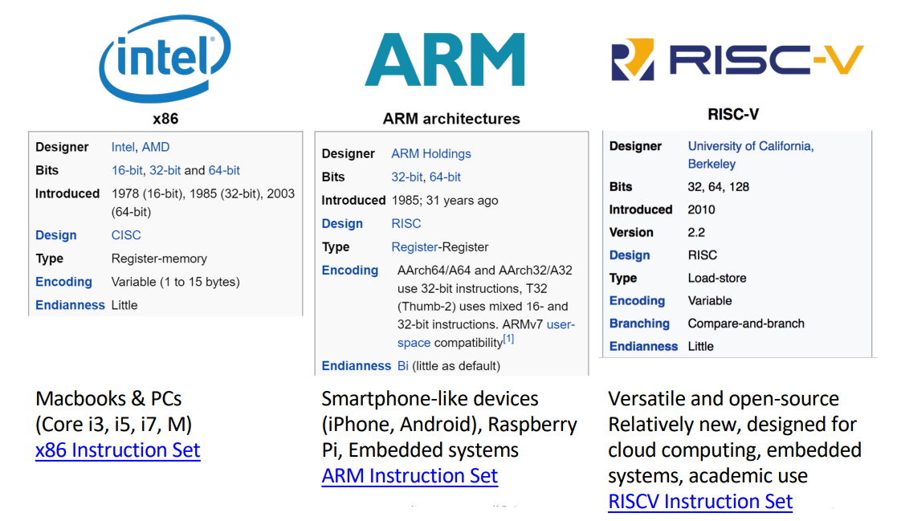
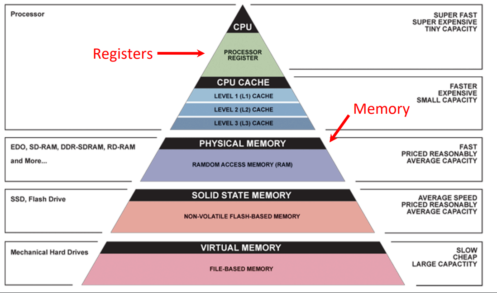
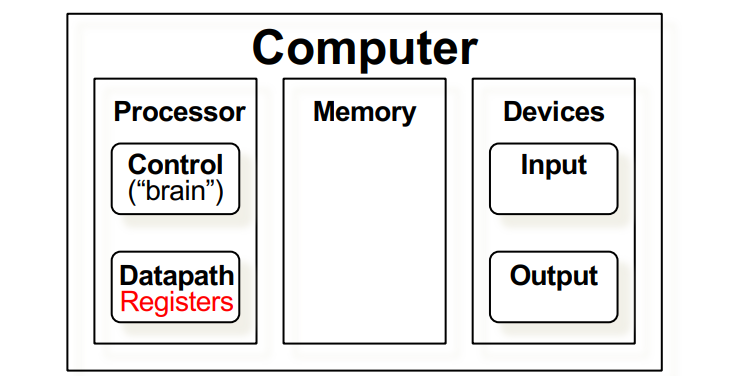

# Lecture06 Assembly Intro

## 1. Background

* A low-level programming language where the program instructions match a **particular architecture’s** operations

* Each architecture will have a different set of operations that it supports (although there are many similarities)

* Assembly is **not portable** to other architectures (unlike C is)

### 1.1 Complex/Reduced Instruction Set Computing
* Early trend: add more and more instructions to do elaborate operations: **Complex Instruction Set Computing (CISC)** 
    * difficult to learn and comprehend language
    * less work for the compiler
    * complicated hardware runs more slowly

* Opposite philosophy later began to dominate: **Reduced Instruction Set Computing (RISC)**
    * Simpler (and smaller) instruction set makes it easier to build fast hardware
    * Let software do the complicated operations by composing simpler ones

### 1.2 Mainstream Instruction Set Architectures


## 2. Registers
* Unlike C, assembly doesn’t have variables as you know them
* Instead, assembly uses **registers** to store values, and Registers are:
    * Small memories of a **fixed size** (32/64-bit in our system)
    * Can be **read** or **written**
    * **Limited in number** (there are 32/64 registers on our system)
    * Very **fast** and **low power** to access
* SO, In high-level languages (like C), number of variables **limited only by available memory**
* Assembly have a **fixed**, **small number** of operands called **registers** (which is a Special locations built directly into hardware)
    * **Benefit**: Registers are EXTREMELY FAST (faster than 1 billionth of a second)
    * **Drawback**: Operations can only be performed on these predetermined number of registers

### 2.1 Memory V.s. Register
* What if ***more*** variables ***than*** registers?
    * Keep **most frequently used in registers** and move the rest to memory (called ***spilling*** to memory)
* Why are not all variables in memory?
    * **Smaller is faster**: registers is 100-500 times faster than Memory
    * Memory Hierarchy
        * **Registers**: 32 registers * 32 bits = 128 Bytes
        * **RAM**: 4-32 GB
        * **SSD**: 100-1000 GB

* **🏆 *Principle of Locality/Memory Hierarchy***
  
    

### 2.2 Number of Registers and RISC-V's Registers
* Should Tradeoff between speed and availability
    * more registers → can house more variables
    * But simultaneously, all registers will be slower
* RISCV has ***32*** registers (**x0-x31**)
    * Each register is **32 bits wide** and holds a ***word***
    * Note: **🏆 <u>a word is a fixedsized piece of data handled as a unit by the instruction set or hardware of the processor. Normally a word is defined as the size of a CPU’s registers</u>**
* Registers have **No Type!**
    * the operation being performed determines how register contents are treated
* Register denoted by ‘x’ can be referenced by number (x0-x31) or name
    * Registers that hold **programmer variables**:
        * `s0`-`s1` $\Leftrightarrow$ `x8`-`x9`
        * `s2`-`s11` $\Leftrightarrow$ `x18`-`x27`
        * `s` is Register ‘Name’
        * `x` is Register ‘ID’/number    
    * Registers that hold **temporary variables**:
        * `t0`-`t2` $\Leftrightarrow$ `x5`-`x7`
        * `t3`-`t6` $\Leftrightarrow$ `x28`-`x31`
    * Other registers have special purposes we’ll discuss later

### 2.4 Registers in a Computer
* For ***any*** Computer, it has: 
    
    * Control
    * Datapath
    * Memory
    * Input
    * Output

* Registers are part of the Datapath

## 3. RISCV Instructions
* Instruction Syntax is rigid, to Keep hardware simple via regularity (1 operator, 3 operands)
    ```assembly
    op dst, src1, src2
    ```
    * `op` = operation name (“operator”)
    * `dst` = register getting result (“destination”)
    * `src1` = first register for operation (“source 1”)
    * `src2` = second register for operation (“source 2”)
* One operation per instruction, at most one instruction per line

### 3.1 Basic Arithmetic Instructions 
add, sub, 


### 3.2 Immediate Instructions


### 3.3 Data Transfer Instructions


### 3.4 Control Flow Instructions


### 3.5 Shifting Instructions


### 3.6 Other useful Instructions


